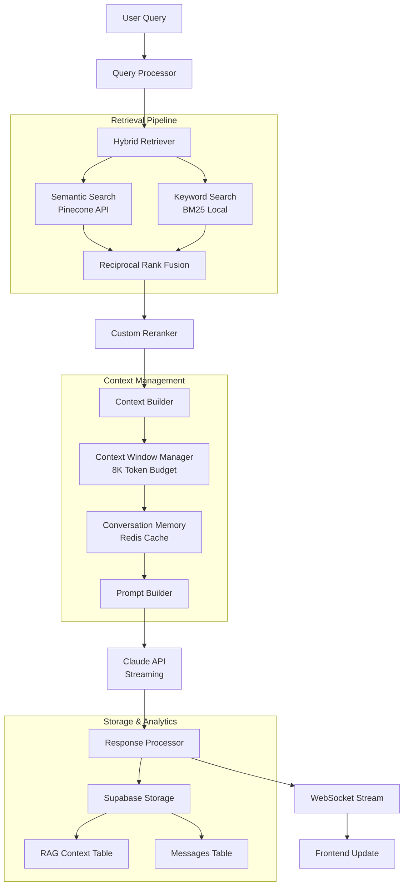
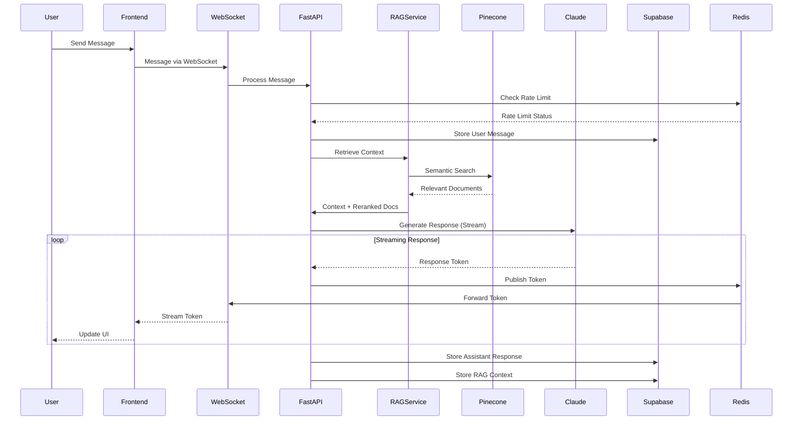

# System Integration Documentation

This document contains cross-component integration patterns, external service integrations, and system-wide architectural decisions for the Eloquent AI chatbot platform.

## Table of Contents

1. [System Architecture Overview](#system-architecture-overview)
2. [External Service Integrations](#external-service-integrations)
3. [RAG System Integration](#rag-system-integration)
4. [Authentication & Security Integration](#authentication--security-integration)
5. [Real-time Communication](#real-time-communication)
6. [Data Flow Architecture](#data-flow-architecture)
7. [Caching & Performance](#caching--performance)
8. [Error Handling & Fallbacks](#error-handling--fallbacks)
9. [Monitoring & Observability](#monitoring--observability)

---

## System Architecture Overview

### High-Level Integration Map

The Eloquent AI system integrates multiple external services and internal components through a well-defined architecture:

```
Client Layer (Next.js/Vercel) 
    ↓ HTTPS/WSS
API Gateway Layer (AWS API Gateway)
    ↓ Rate Limiting & Auth
Application Layer (FastAPI/AWS App Runner)
    ↓ Multiple Integrations
External Services:
├── Pinecone (Vector Database)
├── Claude API (Anthropic)
├── Clerk (Authentication)
├── Supabase (PostgreSQL)
├── Redis (ElastiCache)
└── Monitoring (CloudWatch/Sentry)
```

### Key Integration Principles

1. **Service Isolation**: Each external service is abstracted through service layers
2. **Circuit Breaker Pattern**: Fallback mechanisms for service failures
3. **Async Processing**: Non-blocking operations with queuing for heavy tasks
4. **Event-Driven**: Redis Pub/Sub for real-time features
5. **Graceful Degradation**: Core functionality maintained during service outages

---

## External Service Integrations

### 1. Pinecone Vector Database Integration

**Purpose**: Primary vector storage for RAG retrieval system

**Configuration**:
- **Index**: `ai-powered-chatbot-challenge`
- **Dimensions**: 1024 (llama-text-embed-v2 model)
- **Metric**: Cosine similarity
- **Host**: `https://ai-powered-chatbot-challenge-omkb0qa.svc.aped-4627-b74a.pinecone.io`
- **Region**: AWS us-east-1
- **Capacity**: Serverless mode

**Integration Pattern**:
```python
class PineconeService:
    async def semantic_search(
        self, 
        query_vector: List[float], 
        top_k: int = 10,
        filter_metadata: Dict = None
    ) -> List[Document]:
        """
        Performs semantic search with filtering
        """
        # Circuit breaker implementation
        # Retry with exponential backoff
        # Caching layer for frequent queries
```

**Error Handling**:
- **Connection Timeout**: 30s timeout with 3 retries
- **Rate Limiting**: Exponential backoff (1s, 2s, 4s, 8s)
- **Service Unavailable**: Fallback to cached results or BM25 search

### 2. Claude API (Anthropic) Integration

**Purpose**: Primary LLM for response generation with streaming support

**Configuration**:
- **Model**: Claude-3-5-Sonnet (production) / Claude-3-Haiku (development)
- **Max Tokens**: 8000 (optimized for context window)
- **Streaming**: Token-by-token streaming via WebSocket
- **Rate Limits**: 10 requests/minute per user

**Integration Pattern**:
```python
class ClaudeService:
    async def generate_streaming_response(
        self,
        messages: List[Message],
        context: str,
        stream_callback: Callable
    ):
        """
        Streams response with context injection
        """
        # Prepare prompt with RAG context
        # Token counting and budget management  
        # Real-time streaming via WebSocket
        # Usage tracking and cost optimization
```

**Context Management**:
- **System Prompt**: Fintech FAQ specialist instructions
- **RAG Context**: Top 5 relevant documents (40% of token budget)
- **Conversation History**: Recent 10 messages (30% of token budget)
- **Buffer**: 10% reserved for response generation

### 3. Clerk Authentication Integration

**Purpose**: User authentication and session management

**Integration Flow**:
1. **Frontend**: Clerk React components handle auth UI
2. **Backend**: JWT validation middleware verifies all requests
3. **Webhooks**: User lifecycle events sync to Supabase
4. **Anonymous Users**: Cookie-based session tracking before auth

**Webhook Handling**:
```python
@app.post("/webhooks/clerk")
async def handle_clerk_webhook(request: Request):
    """
    Processes user lifecycle events
    - user.created: Create user record in Supabase
    - user.updated: Sync profile changes
    - user.deleted: Archive user data (GDPR compliance)
    """
```

### 4. Supabase PostgreSQL Integration

**Purpose**: Primary database for chat history, user data, and analytics

**Connection Management**:
- **Pool Size**: 10-25 connections per instance
- **Connection Timeout**: 30 seconds
- **Retry Logic**: 3 attempts with exponential backoff
- **Health Checks**: Every 30 seconds

**Schema Integration**:
- **Row Level Security (RLS)**: User data isolation
- **Partitioning**: Messages table partitioned by month
- **Indexes**: Optimized for chat queries and search
- **Materialized Views**: User analytics and reporting

### 5. Redis (ElastiCache) Integration

**Purpose**: Caching, session storage, rate limiting, and pub/sub messaging

**Usage Patterns**:
```python
# Caching Layer
cache_key = f"rag_results:{hash(query)}"
cached_results = await redis.get(cache_key)

# Rate Limiting
rate_limit_key = f"rate_limit:{user_id}:{endpoint}"
current_count = await redis.incr(rate_limit_key)

# Pub/Sub for Real-time
await redis.publish(f"chat:{chat_id}", message_data)
```

**Data Structure**:
- **Cache**: TTL-based caching (RAG: 15min, Sessions: 1hr)
- **Rate Limits**: Sliding window counters
- **Session Storage**: Anonymous user sessions
- **Message Queues**: Background task processing

---

## RAG System Integration

### Complete RAG Pipeline Architecture



### Hybrid Search Implementation

**Semantic + Keyword Search Fusion**:
```python
class HybridRetriever:
    def __init__(self):
        self.pinecone_client = PineconeService()
        self.bm25_index = BM25Index()  # Local BM25 for keyword search
        
    async def retrieve(self, query: str, top_k: int = 10) -> List[Document]:
        # Parallel execution
        semantic_task = self.pinecone_client.search(query, k=top_k*2)
        keyword_task = self.bm25_index.search(query, k=top_k*2)
        
        semantic_results, keyword_results = await asyncio.gather(
            semantic_task, keyword_task
        )
        
        # Reciprocal Rank Fusion (70% semantic, 30% keyword)
        fused_results = self.reciprocal_rank_fusion(
            semantic_results, keyword_results, weights=[0.7, 0.3]
        )
        
        return fused_results[:top_k]
```

### Multi-Stage Reranking

**Context-Aware Reranking Pipeline**:
```python
class CustomReranker:
    def rerank(self, query: str, documents: List[Document]) -> List[Document]:
        # Stage 1: Relevance scoring with query-document similarity
        relevance_scores = self.calculate_relevance(query, documents)
        
        # Stage 2: Diversity optimization (avoid redundant information)
        diverse_docs = self.maximize_diversity(documents, relevance_scores)
        
        # Stage 3: Recency weighting (newer FAQ content prioritized)
        final_docs = self.apply_recency_weight(diverse_docs)
        
        # Stage 4: Context length optimization
        optimized_docs = self.fit_context_window(final_docs, max_tokens=3200)
        
        return optimized_docs[:5]  # Top 5 for context injection
```

### Context Window Management

**Intelligent Token Allocation**:
```python
class ContextWindowManager:
    MAX_TOKENS = 8000  # Claude context limit
    
    def build_context(
        self,
        query: str,
        retrieved_docs: List[Document], 
        conversation_history: List[Message]
    ) -> Dict[str, str]:
        # Token budget allocation
        system_tokens = 800      # 10% - System prompt
        context_tokens = 3200    # 40% - RAG documents  
        history_tokens = 2400    # 30% - Conversation
        query_tokens = 400       # 5% - Current query
        buffer_tokens = 1200     # 15% - Response buffer
        
        return {
            "system": self.get_system_prompt(),
            "context": self.compress_documents(retrieved_docs, context_tokens),
            "history": self.summarize_history(conversation_history, history_tokens),
            "query": query
        }
```

### Conversation Memory System

**Multi-Level Memory Architecture**:
```python
class ConversationMemory:
    def __init__(self, redis_client):
        self.redis = redis_client
        self.short_term = []  # Current session (in-memory)
        
    async def update_memory(self, message: Message):
        # Add to short-term memory
        self.short_term.append(message)
        
        # Compress to long-term if session too long
        if len(self.short_term) > 10:
            summary = await self.summarize_conversation(self.short_term[:5])
            await self.redis.set(
                f"conversation_summary:{message.chat_id}", 
                summary, 
                ex=3600  # 1 hour TTL
            )
            self.short_term = self.short_term[5:]
        
        # Extract and store key interactions
        if self.is_key_interaction(message):
            await self.store_episodic_memory(message)
```

---

## Authentication & Security Integration

### Authentication Flow Integration

**Clerk → Backend → Database Flow**:
```python
# JWT Middleware Integration
class JWTAuthenticationMiddleware:
    async def authenticate_request(self, request: Request):
        # 1. Extract JWT from Authorization header
        token = self.extract_token(request)
        
        # 2. Verify with Clerk API  
        user_info = await self.clerk_client.verify_token(token)
        
        # 3. Load/create user in Supabase
        user = await self.user_service.get_or_create_user(user_info)
        
        # 4. Attach to request context
        request.state.user = user
        
        return user
```

### Anonymous User Integration

**Cookie-Based Session Management**:
```python
class AnonymousUserService:
    async def create_anonymous_session(self, request: Request) -> str:
        # Generate secure session ID
        session_id = secrets.token_urlsafe(32)
        
        # Store in Redis with TTL
        await self.redis.setex(
            f"anonymous_session:{session_id}",
            30 * 24 * 3600,  # 30 days
            json.dumps({"created_at": datetime.utcnow().isoformat()})
        )
        
        # Set secure HTTP-only cookie
        response.set_cookie(
            "session_id",
            session_id,
            httponly=True,
            secure=True,
            samesite="strict",
            max_age=30 * 24 * 3600
        )
        
        return session_id
        
    async def migrate_to_authenticated(self, session_id: str, user_id: str):
        # Transfer chat history from anonymous to authenticated user
        anonymous_chats = await self.chat_service.get_chats_by_session(session_id)
        
        for chat in anonymous_chats:
            await self.chat_service.transfer_ownership(chat.id, user_id)
            
        # Clean up anonymous session
        await self.redis.delete(f"anonymous_session:{session_id}")
```

### Multi-Tier Rate Limiting Integration

**Distributed Rate Limiting with Redis**:
```python
class RateLimiter:
    LIMITS = {
        "global": (1000, 60),      # 1000 req/min per IP
        "authenticated": (100, 60), # 100 req/min per user  
        "anonymous": (20, 60),     # 20 req/min per session
        "llm_calls": (10, 60),     # 10 LLM calls/min per user
    }
    
    async def check_rate_limit(
        self, 
        identifier: str, 
        limit_type: str
    ) -> Tuple[bool, Dict]:
        max_requests, window_seconds = self.LIMITS[limit_type]
        
        # Sliding window implementation
        key = f"rate_limit:{limit_type}:{identifier}"
        pipe = self.redis.pipeline()
        
        # Add current timestamp
        now = time.time()
        pipe.zadd(key, {str(now): now})
        
        # Remove expired entries
        pipe.zremrangebyscore(key, 0, now - window_seconds)
        
        # Count current requests
        pipe.zcard(key)
        
        # Set expiration
        pipe.expire(key, window_seconds)
        
        results = await pipe.execute()
        current_requests = results[2]
        
        allowed = current_requests <= max_requests
        
        return allowed, {
            "limit": max_requests,
            "current": current_requests,
            "reset_time": now + window_seconds
        }
```

---

## Real-time Communication

### WebSocket Integration Architecture

**Real-time Streaming Implementation**:
```python
class WebSocketManager:
    def __init__(self):
        self.connections: Dict[str, WebSocket] = {}
        self.redis_client = RedisClient()
        
    async def connect(self, websocket: WebSocket, chat_id: str):
        await websocket.accept()
        self.connections[chat_id] = websocket
        
        # Subscribe to Redis pub/sub for this chat
        pubsub = self.redis_client.pubsub()
        await pubsub.subscribe(f"chat:{chat_id}")
        
        # Handle messages in background
        asyncio.create_task(self.handle_pubsub_messages(pubsub, websocket))
        
    async def stream_llm_response(self, chat_id: str, message_id: str):
        """Stream LLM tokens to connected clients"""
        async for token in self.claude_client.stream_response():
            message = {
                "type": "stream_token",
                "payload": {
                    "message_id": message_id,
                    "token": token,
                    "timestamp": datetime.utcnow().isoformat()
                }
            }
            
            # Publish to Redis (handles multiple instances)
            await self.redis_client.publish(
                f"chat:{chat_id}", 
                json.dumps(message)
            )
            
    async def handle_pubsub_messages(self, pubsub, websocket: WebSocket):
        """Forward Redis pub/sub messages to WebSocket clients"""
        try:
            async for message in pubsub.listen():
                if message["type"] == "message":
                    await websocket.send_text(message["data"])
        except WebSocketDisconnect:
            await self.disconnect(websocket)
```

### Server-Sent Events (SSE) Fallback

**Graceful Degradation for WebSocket Failures**:
```python
@app.get("/chats/{chat_id}/messages/stream")
async def stream_chat_messages(
    chat_id: str,
    request: Request,
    current_user: User = Depends(get_current_user)
):
    """SSE fallback when WebSocket unavailable"""
    
    async def event_stream():
        # Subscribe to Redis pub/sub
        pubsub = redis_client.pubsub()
        await pubsub.subscribe(f"chat:{chat_id}")
        
        try:
            async for message in pubsub.listen():
                if message["type"] == "message":
                    # Format as SSE
                    yield f"data: {message['data']}\n\n"
                    
                # Check if client disconnected
                if await request.is_disconnected():
                    break
                    
        finally:
            await pubsub.unsubscribe(f"chat:{chat_id}")
            
    return StreamingResponse(
        event_stream(),
        media_type="text/plain",
        headers={
            "Cache-Control": "no-cache",
            "Connection": "keep-alive"
        }
    )
```

---

## Data Flow Architecture

### End-to-End Message Processing Flow



### Batch Processing Integration

**Background Task Processing**:
```python
# Celery task for batch operations
@celery_app.task
async def process_chat_analytics(chat_ids: List[str]):
    """Background processing for analytics and insights"""
    
    for chat_id in chat_ids:
        # Extract conversation insights
        messages = await db.get_chat_messages(chat_id)
        
        # Generate analytics
        analytics = await analytics_service.analyze_conversation(messages)
        
        # Store insights
        await db.store_chat_analytics(chat_id, analytics)
        
        # Update search indexes if needed
        await search_service.update_chat_index(chat_id, messages)

# Trigger from main application
@app.post("/chats/{chat_id}/complete")
async def complete_chat(chat_id: str):
    # Queue analytics processing
    process_chat_analytics.delay([chat_id])
    
    return {"status": "completed", "analytics_queued": True}
```

---

## Caching & Performance

### Multi-Layer Caching Strategy

**Application-Level Caching**:
```python
# In-memory caching for frequently accessed data
class ApplicationCache:
    def __init__(self):
        self.memory_cache = {}  # Simple LRU cache
        self.redis_cache = RedisClient()
        
    async def get_user_preferences(self, user_id: str) -> Dict:
        # L1: Memory cache
        if user_id in self.memory_cache:
            return self.memory_cache[user_id]
            
        # L2: Redis cache  
        cached_prefs = await self.redis_cache.get(f"user_prefs:{user_id}")
        if cached_prefs:
            self.memory_cache[user_id] = json.loads(cached_prefs)
            return self.memory_cache[user_id]
            
        # L3: Database (with cache backfill)
        prefs = await self.db.get_user_preferences(user_id)
        
        # Cache in both layers
        self.memory_cache[user_id] = prefs
        await self.redis_cache.setex(
            f"user_prefs:{user_id}", 
            3600,  # 1 hour TTL
            json.dumps(prefs)
        )
        
        return prefs
```

**RAG Result Caching**:
```python
class RAGCacheManager:
    async def get_cached_results(self, query_hash: str) -> Optional[List[Document]]:
        """Get cached RAG results with TTL consideration"""
        
        cache_key = f"rag_results:{query_hash}"
        cached_data = await self.redis.get(cache_key)
        
        if cached_data:
            results = json.loads(cached_data)
            
            # Check cache freshness (15-minute TTL)
            cache_time = datetime.fromisoformat(results["timestamp"])
            if datetime.utcnow() - cache_time < timedelta(minutes=15):
                return results["documents"]
                
        return None
        
    async def cache_results(self, query_hash: str, documents: List[Document]):
        """Cache RAG results with metadata"""
        
        cache_data = {
            "timestamp": datetime.utcnow().isoformat(),
            "documents": [doc.dict() for doc in documents],
            "ttl": 15 * 60  # 15 minutes
        }
        
        await self.redis.setex(
            f"rag_results:{query_hash}",
            15 * 60,
            json.dumps(cache_data)
        )
```

### Connection Pooling & Resource Management

**Database Connection Management**:
```python
# SQLAlchemy async engine configuration
engine = create_async_engine(
    DATABASE_URL,
    pool_size=10,          # Base connections
    max_overflow=20,       # Additional connections during peak
    pool_pre_ping=True,    # Validate connections
    pool_recycle=3600,     # Recycle every hour
    echo=False             # Disable SQL logging in production
)

# Session management with connection pooling
class DatabaseService:
    async def get_session(self) -> AsyncSession:
        async with AsyncSession(engine) as session:
            try:
                yield session
                await session.commit()
            except Exception:
                await session.rollback()
                raise
            finally:
                await session.close()
```

---

## Error Handling & Fallbacks

### Circuit Breaker Pattern Implementation

**External Service Protection**:
```python
class CircuitBreaker:
    def __init__(self, failure_threshold: int = 5, timeout: int = 60):
        self.failure_threshold = failure_threshold
        self.timeout = timeout
        self.failure_count = 0
        self.last_failure_time = None
        self.state = "CLOSED"  # CLOSED, OPEN, HALF_OPEN
        
    async def call(self, func, *args, **kwargs):
        if self.state == "OPEN":
            if time.time() - self.last_failure_time > self.timeout:
                self.state = "HALF_OPEN"
            else:
                raise CircuitBreakerOpenException("Service temporarily unavailable")
                
        try:
            result = await func(*args, **kwargs)
            
            # Reset on success
            if self.state == "HALF_OPEN":
                self.state = "CLOSED"
                self.failure_count = 0
                
            return result
            
        except Exception as e:
            self.failure_count += 1
            self.last_failure_time = time.time()
            
            if self.failure_count >= self.failure_threshold:
                self.state = "OPEN"
                
            raise e

# Usage in services
class PineconeService:
    def __init__(self):
        self.circuit_breaker = CircuitBreaker()
        
    async def search(self, query_vector: List[float]):
        try:
            return await self.circuit_breaker.call(
                self._direct_search, 
                query_vector
            )
        except CircuitBreakerOpenException:
            # Fallback to cached results
            return await self.get_fallback_results(query_vector)
```

### Graceful Degradation Strategies

**Service-Specific Fallbacks**:
```python
class RAGService:
    async def retrieve_with_fallback(self, query: str) -> List[Document]:
        """Multi-tier fallback strategy for RAG retrieval"""
        
        try:
            # Primary: Hybrid search (Pinecone + BM25)
            return await self.hybrid_retriever.retrieve(query)
            
        except PineconeException:
            logger.warning("Pinecone unavailable, falling back to BM25")
            
            try:
                # Fallback 1: Local BM25 search only
                return await self.bm25_retriever.retrieve(query)
                
            except Exception:
                logger.error("BM25 search failed, using cached results")
                
                # Fallback 2: Return cached popular results
                return await self.get_popular_cached_results()
                
        except Exception as e:
            logger.error(f"All retrieval methods failed: {e}")
            
            # Fallback 3: Return empty context (LLM general knowledge)
            return []

class ClaudeService:
    async def generate_with_fallback(self, prompt: str) -> str:
        """LLM generation with fallback models"""
        
        try:
            # Primary: Claude-3-5-Sonnet
            return await self.claude_client.generate(prompt, model="claude-3-5-sonnet")
            
        except RateLimitException:
            logger.warning("Claude rate limited, trying Haiku")
            
            # Fallback: Claude-3-Haiku (faster, cheaper)
            return await self.claude_client.generate(prompt, model="claude-3-haiku")
            
        except Exception as e:
            logger.error(f"Claude API failed: {e}")
            
            # Final fallback: Pre-generated response
            return "I apologize, but I'm experiencing technical difficulties. Please try again in a moment."
```

### Error Context Preservation

**Structured Error Tracking**:
```python
class ErrorTracker:
    async def track_error(
        self,
        error: Exception,
        context: Dict,
        severity: str = "ERROR"
    ):
        """Track errors with full context for debugging"""
        
        error_data = {
            "timestamp": datetime.utcnow().isoformat(),
            "error_type": type(error).__name__,
            "error_message": str(error),
            "severity": severity,
            "user_id": context.get("user_id"),
            "chat_id": context.get("chat_id"),
            "request_id": context.get("request_id"),
            "endpoint": context.get("endpoint"),
            "stack_trace": traceback.format_exc(),
            "system_state": {
                "memory_usage": psutil.virtual_memory().percent,
                "cpu_usage": psutil.cpu_percent(),
                "redis_connected": await self.check_redis_health(),
                "db_connected": await self.check_db_health()
            }
        }
        
        # Send to multiple monitoring services
        await asyncio.gather(
            self.sentry_client.capture_exception(error, context=error_data),
            self.cloudwatch_client.put_metric_data(error_data),
            self.store_error_in_db(error_data)
        )
```

---

## Monitoring & Observability

### Comprehensive Monitoring Integration

**Multi-Layer Monitoring Setup**:
```python
# Application metrics collection
class MetricsCollector:
    def __init__(self):
        self.cloudwatch = CloudWatchClient()
        self.sentry = SentryClient()
        self.posthog = PostHogClient()
        
    async def track_request(
        self,
        endpoint: str,
        duration: float,
        status_code: int,
        user_id: Optional[str] = None
    ):
        # Performance metrics to CloudWatch
        await self.cloudwatch.put_metric_data([
            {
                "MetricName": "RequestDuration",
                "Value": duration,
                "Unit": "Milliseconds",
                "Dimensions": [
                    {"Name": "Endpoint", "Value": endpoint},
                    {"Name": "StatusCode", "Value": str(status_code)}
                ]
            },
            {
                "MetricName": "RequestCount", 
                "Value": 1,
                "Unit": "Count",
                "Dimensions": [{"Name": "Endpoint", "Value": endpoint}]
            }
        ])
        
        # Business metrics to PostHog
        if user_id:
            await self.posthog.capture(
                user_id,
                "api_request",
                {
                    "endpoint": endpoint,
                    "duration_ms": duration,
                    "status_code": status_code
                }
            )
            
    async def track_rag_performance(
        self,
        query: str,
        retrieval_time: float,
        generation_time: float,
        context_relevance: float
    ):
        """Track RAG-specific metrics"""
        
        await self.cloudwatch.put_metric_data([
            {
                "MetricName": "RAGRetrievalTime",
                "Value": retrieval_time,
                "Unit": "Milliseconds"
            },
            {
                "MetricName": "RAGGenerationTime", 
                "Value": generation_time,
                "Unit": "Milliseconds"
            },
            {
                "MetricName": "RAGContextRelevance",
                "Value": context_relevance,
                "Unit": "Percent"
            }
        ])
```

**Health Check Integration**:
```python
@app.get("/health")
async def health_check():
    """Comprehensive health check endpoint"""
    
    health_status = {
        "status": "healthy",
        "timestamp": datetime.utcnow().isoformat(),
        "version": app.version,
        "services": {}
    }
    
    # Check all external dependencies
    services_to_check = [
        ("database", check_database_health),
        ("redis", check_redis_health), 
        ("pinecone", check_pinecone_health),
        ("claude", check_claude_health),
        ("clerk", check_clerk_health)
    ]
    
    for service_name, check_func in services_to_check:
        try:
            start_time = time.time()
            await check_func()
            response_time = (time.time() - start_time) * 1000
            
            health_status["services"][service_name] = {
                "status": "healthy",
                "response_time_ms": response_time
            }
        except Exception as e:
            health_status["services"][service_name] = {
                "status": "unhealthy", 
                "error": str(e)
            }
            health_status["status"] = "degraded"
    
    # Overall system health
    unhealthy_services = [
        name for name, info in health_status["services"].items() 
        if info["status"] == "unhealthy"
    ]
    
    if len(unhealthy_services) >= 2:
        health_status["status"] = "unhealthy"
        
    return health_status
```

---

## Integration Testing & Validation

### End-to-End Integration Tests

**Critical Path Testing**:
```python
@pytest.mark.integration
async def test_complete_chat_flow():
    """Test complete user journey from auth to response"""
    
    # 1. Authenticate user
    user_token = await create_test_user_with_clerk()
    
    # 2. Create chat session
    chat_response = await client.post(
        "/chats",
        headers={"Authorization": f"Bearer {user_token}"},
        json={"title": "Test Chat"}
    )
    chat_id = chat_response.json()["data"]["id"]
    
    # 3. Send message and verify RAG pipeline
    message_response = await client.post(
        f"/chats/{chat_id}/messages",
        headers={"Authorization": f"Bearer {user_token}"},
        json={"content": "What are your security measures?"}
    )
    
    # Verify response structure
    assert message_response.status_code == 200
    response_data = message_response.json()["data"]
    
    # Verify RAG context was used
    assert "retrieved_context" in response_data["metadata"]
    assert len(response_data["metadata"]["retrieved_context"]) > 0
    
    # Verify message was stored
    stored_messages = await client.get(
        f"/chats/{chat_id}/messages",
        headers={"Authorization": f"Bearer {user_token}"}
    )
    
    assert len(stored_messages.json()["data"]) == 2  # User + Assistant

@pytest.mark.integration  
async def test_service_fallback_behavior():
    """Test graceful degradation when services fail"""
    
    # Simulate Pinecone failure
    with mock.patch.object(PineconeService, 'search') as mock_pinecone:
        mock_pinecone.side_effect = ConnectionError("Pinecone unavailable")
        
        # Should fallback to BM25 search
        response = await client.post(
            f"/chats/{chat_id}/messages",
            headers={"Authorization": f"Bearer {user_token}"},
            json={"content": "Test query"}
        )
        
        # Response should still be successful
        assert response.status_code == 200
        
        # Check that fallback was used
        assert "fallback_used" in response.json()["metadata"]
```

This comprehensive integration documentation provides AI agents with a complete understanding of how all system components work together, the external service dependencies, data flows, and failure handling mechanisms. The documentation focuses on practical integration patterns and real-world scenarios that developers and AI agents need to understand when working with the system.
